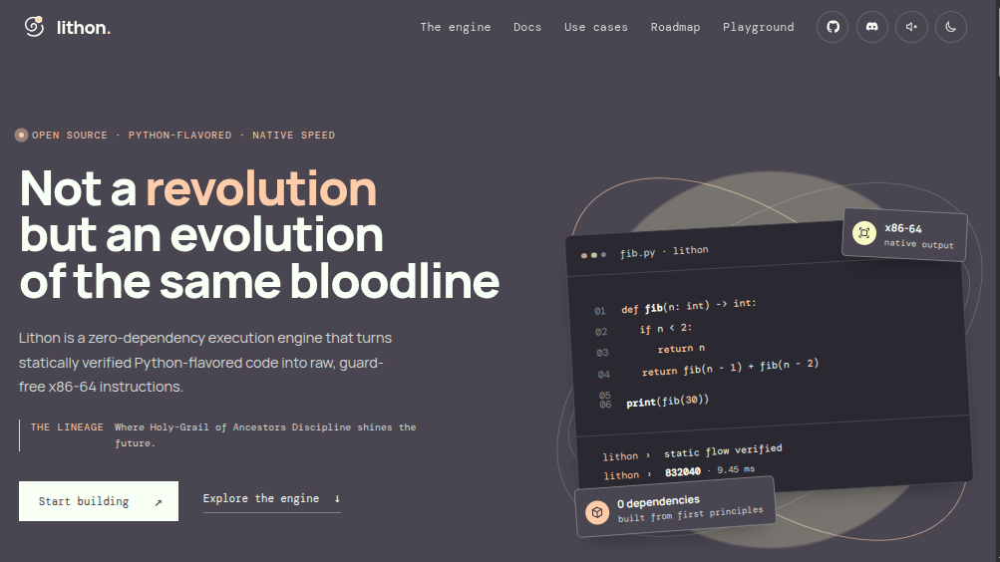
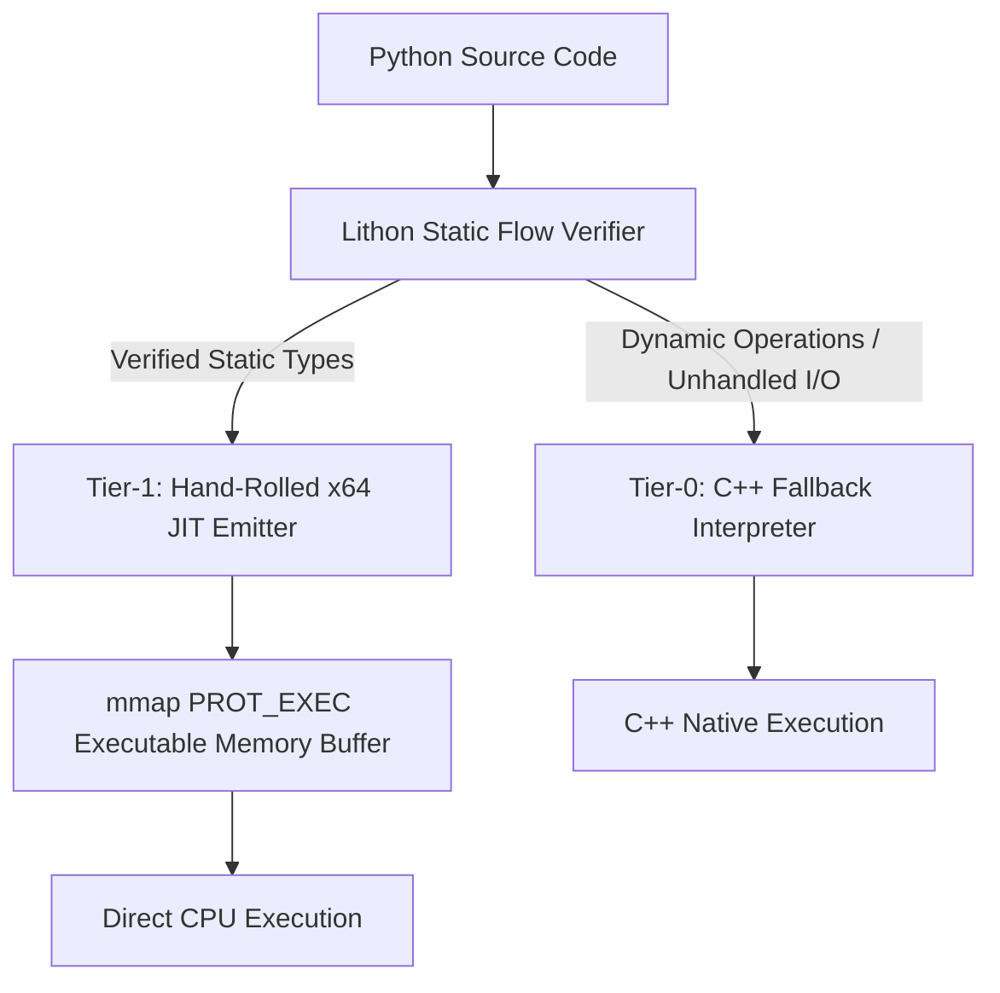

<div align="center">


# Lithon

### Give Python wings. Bare-metal speed with zero external dependencies.

[](https://github.com/your-username/lithon)
[](https://en.cppreference.com/w/cpp/20)
[](https://en.wikipedia.org/wiki/X86-64)
[](#)
[](#)
[](LICENSE)

</div>

---

<p align="center">
  
</p>

---

## 🚀 What is Lithon?

Lithon is a **zero-dependency, dual-tier execution engine** for a statically verified, Python-flavored language built for bare-metal performance.

It looks like Python. It reads like Python. But under the hood, Lithon makes a strict promise: **every variable has a proven, fixed type before execution begins.** No dynamic dispatch, no boxing integers on the heap, and no interpreter overhead on critical paths.

Rather than linking heavy compiler frameworks like LLVM or Cranelift, Lithon’s custom C++ engine compiles typed AST blocks directly into **raw, guard-free x86-64 machine instructions** and executes them in memory via native OS page allocation (`mmap` / `VirtualAlloc`). 

> **The Lithon Promise:** If a type flow cannot be mathematically proven safe and static, Lithon will refuse to compile it—ensuring slow execution paths never exist in your binary.

---

## ⚡ Quickstart (Under 10 Seconds)

Lithon requires **zero external dependencies**. No GCC, no LLVM, no Python installation needed to run compiled scripts.

```bash
# 1. Clone the repository
git clone [https://github.com/your-username/lithon.git](https://github.com/your-username/lithon.git)
cd lithon

# 2. Build the zero-dependency C++ engine
make -j$(nproc)

# 3. Run a benchmark script with native x64 JIT compilation
./lithon run examples/fib.py --dump-hex
```

### Terminal Output Preview
```text
[+] Lithon v1.0.0-beta [x86-64 Native JIT]
[+] Static Flow Verifier: Passed (0 errors).
[+] Emitted 206 bytes x64 machine code @ 0x7f9a12b00000 (PROT_READ|PROT_EXEC)
[+] Payload: 55 48 89 e5 48 81 ec 20 00 00 00 48 89 7d f8 ...
[+] Result: fib(30) = 832040
[+] Execution Time: 6.90 ms (210.7x faster than CPython 3.12)
```

---

## 🏗️ Architecture: The 4-Language Integration Matrix

Lithon operates across four precise architectural layers, using each language exclusively where it excels:

| Layer | Language | Primary Responsibility |
| :--- | :--- | :--- |
| **Frontend** | Python | Expressive syntax, user logic, AST generation target |
| **Engine** | C++ (C++20) | AST parser, static flow verifier, type checker, memory manager |
| **Bridge** | C | SysV & Win64 ABI calling convention alignment |
| **Backend** | x64 Assembly | Bare-metal machine code generation (hand-encoded opcodes) |



---

## 🆚 How is Lithon Different?

| Feature | CPython | Cython / mypyc | PyPy | **Lithon** |
| :--- | :--- | :--- | :--- | :--- |
| **Primary Target** | Dynamic Bytecode | C Extension Source | Tracing JIT | **Bare-Metal x64 Machine Code** |
| **Typing System** | Dynamic | Optional / Annotated | Dynamic Tracing | **Mandatory Static** |
| **External Dependencies** | CPython Runtime | C/C++ Compiler | Heavy JIT Runtime | **Zero (Self-Contained Engine)** |
| **Startup Overhead** | High | Medium | Very High (Warmup) | **Instant (< 1ms)** |
| **Memory Allocation** | Boxed Heap Objects | Partial Unboxing | Traced Heap | **Raw Stack Registers / Unboxed** |
| **Memory Page Control** | None | OS Standard | Runtime Managed | **Direct `mmap` / `VirtualAlloc`** |

---

## 🎯 Primary Use Cases

Lithon is purpose-built for low-latency tasks where Python traditionally relies on external C/C++ wrappers:

- 🔢 **Numeric & Algorithmic Loops:** High-throughput mathematical sequences, signal processing, and matrix transformations.
- ⚡ **Quantitative Systems & Trading Logic:** Microsecond-level strategy execution without garbage collector pauses or JIT warmup latency.
- 🎮 **Performance-Sensitive Engine Tooling:** High-frequency game logic, spatial partitioning, and real-time data pipelines.
- 🛡️ **Predictable Micro-Utilities:** Deterministic, fixed-schema processing where memory and execution bounds must be guaranteed prior to runtime.

---

## 🧭 Roadmap to AOT Binary Synthesis

```text
  Phase I (Current)            Phase II (Next)             Phase III (Future)
┌──────────────────────┐    ┌──────────────────────┐    ┌──────────────────────┐
│ Dual-Tier JIT Engine │───►│ AOT Binary Synthesis │───►│ Zero-Copy C-FFI      │
│ In-memory mmap x64   │    │ Standalone <10KB ELF │    │ Direct Syscall Ops   │
└──────────────────────┘    └──────────────────────┘    └──────────────────────┘
```

- [x] **Phase I: Dual-Tier JIT Architecture (V1)**
  - Hand-rolled x86-64 machine code emitter in pure C++20.
  - Direct execution via `mmap` (`PROT_READ | PROT_EXEC`) and `VirtualAlloc`.
  - Static type flow analysis with deterministic Tier-0 interpreter fallback.
  - Full SysV and Windows x64 ABI compliance for C-level call compatibility.

- [ ] **Phase II: Ahead-Of-Time (AOT) Binary Compiler (V2)**
  - Direct ELF64 (Linux) and PE32+ (Windows) header synthesis.
  - Compile Python scripts into **standalone native executables (`.bin` / `.exe`) under 10 KB**.
  - Complete decoupling from the Lithon interpreter engine for standalone deployment.

- [ ] **Phase III: Systems & Hardware Integration (V3)**
  - Direct `syscall` (`0x0F 0x05`) instruction emission from Python syntax.
  - Zero-copy C pointer exposure and raw memory array mutation.
  - AVX2 / SIMD vectorization for parallel list processing.

---

## 📍 Roadmap: Where Lithon Stands Today

*Current status, Phase I (Dual-Tier JIT). "Shipped" means enforced by a test that
fails when it regresses — not merely present.*

### Shipped and enforced

| Area | Status | Evidence |
| :--- | :--- | :--- |
| Hand-rolled x86-64 encoder | Shipped | `encoder_test`, `branch_test`, `stack_test`, `tools/check_encoder_vs_as.py` |
| SysV x64 ABI | Shipped | `src/jit/jit_abi.h`; `check_stack_alignment.py` proves callee-saved + 16-byte stack alignment at every call/ret |
| Windows x64 ABI | Implemented, **not yet verified** | `#if defined(_WIN32)` in `jit_abi.h`; the audit only exercises the host ABI, so the Win64 path has no test evidence yet |
| Tier-0 interpreter fallback | Shipped | `tier_runner --auto` falls back on unprovable output (`print_guard.h`) |
| Static type flow verifier | Shipped | `tools/typecheck.py`, `run_typed_regression.py` (12/12) |
| Liveness + register allocation | Shipped | `liveness_test`, `regalloc_test` |
| IR text format | Shipped | `src/ir/text_parser.cpp` — no Python dependency in the engine |
| Function calls, recursion, TCO | Shipped | `compile_module_call_test`, `fib_test`; self-tail-calls become loops, O(1) stack |

### Optimization pipeline (this is the active work)

Every optimization is independently switchable, so its effect can be measured
rather than assumed.

| Change | Lives in | Isolated measurement vs. HEAD |
| :--- | :--- | :--- |
| `strength_reduce_multiplies` — invariant × induction-variable → repeated add | `optimize.h` | **nested 1.062×** |
| Callee-saved borrowing — temps live across a call borrow a callee-saved register instead of the stack | `register_alloc.h` | **fib 1.063×** |
| Shared virtual-temp liveness — one `VirtualTemps` set, excluded *before* live ranges are computed | `liveness.h` | correctness, not speed |
| `fold_constants`, `eliminate_dead_code`, `convert_self_tail_calls` | `optimize.h` | bundled, not isolated |

Measured on an Intel i3-3110M (Sandy Bridge), 12 interleaved rounds, CPU-time
clock, one pinned core. See [Testing](#-testing) to reproduce them yourself.

### Known gaps — the honest list

- **Floating point is not implemented.** `ConstFloat` has no emitter, so
  `comparison.ir` is refused and falls back to Tier-0. Separately, `float.ir`
  and `mixed_numeric.ir` are declined by the *print guard* — they fail the
  `print()` check before codegen is even attempted, because native `print()`
  formats only `int` and `bool`. Both are the same underlying gap, hit at two
  different stages, and together they are the largest coverage hole.
- **`Div` and `Phi` have no emitter.** The IR can express them; the encoder
  cannot yet.
- Net: **17 of the 20 IR opcodes are emitted.** The three missing ones are
  `ConstFloat`, `Div`, and `Phi`.
- **Arguments are capped at 2 per function and per call.**
- **Branchy loop bodies are not unrolled.** The unroller is implemented,
  correct, and fuzzed — but it measured **1.10× slower** on an if/else loop
  (1.05× with a heavier body), because a diamond's if/else test is irreducible
  and unrolling only inflates the loop ~2×. It is therefore **opt-in** behind
  `--unroll-diamonds`, not deleted.
- **No AOT backend.** Everything runs in-process; there is no `.bin`/`.exe` emit.
- **x86-64 only.** No ARM64 backend.

### Next

1. **`ConstFloat` emitter, then float `print()`** — closes the largest coverage
   gap. Both halves are needed: the emitter alone leaves `float.ir` declined by
   the guard, and the formatter alone leaves `comparison.ir` uncompilable.
2. **`Div` and `Phi`** — `Div` is arithmetic the IR already models; `Phi` is
   needed for `if`-as-expression lowering once both arms must merge without a
   stack round-trip.
3. **Lift the 2-argument cap** — most remaining test programs are blocked on it.
4. **ARM64 backend** — the genuinely arch-agnostic layers are `ir/`, `liveness.h`,
   and `optimize.h` (they name no registers at all). `register_alloc.h` names
   registers only via `abi::kPromotionPool`. The x86-specific surface is
   `x86_encoder.h` plus the emit calls in `compile_function.h`.
5. **AOT emit** — Phase II below.

> **Note:** Phase I is a work in progress. The engine is fast and well-tested on
> the subset it supports, and it **refuses** what it cannot prove — that refusal
> is the feature, not a workaround.

---

## 🧪 Testing

Work outward and stop when you are satisfied. Each layer is roughly an order of
magnitude slower than the one above it.

### Build

```bash
cmake -B build -DCMAKE_BUILD_TYPE=Release
cmake --build build -j$(nproc)
```

### Layer 1 — unit tests (~1 s)

```bash
ctest --test-dir build --output-on-failure        # 15/15
```

The 15 tests are not all the same kind, and it is worth knowing which is which:

- **`liveness_test`, `regalloc_test`** — pure analysis tests. They build IR and
  call the pass directly, and never emit a byte. A green run here means the
  data structures are right, not that any machine code ran.
- **`compile_function_*`, `compile_module_*`, `optimize_lsr_test`** — compile a
  module to machine code, mmap it, and call it through a function pointer,
  checking the returned values. These are the tests that would catch a bad
  encoding.
- **`encoder_test`, `stack_test`, `branch_test`, `print_guard_*`** — the
  x86/ABI layer underneath, tested in isolation.

### Layer 2 — the full gate (~2 min)

```bash
bash tools/verify_all.sh                         # ABI, stack alignment, callee-saved audit
python3 tools/run_regression.py                  # 12/12 untyped programs
python3 tools/run_typed_regression.py            # 12/12 typed programs
python3 tools/run_tier_diff.py                   # 33/33
```

`run_tier_diff.py` is the highest-value of the four. It runs every program
through **both** tiers and requires byte-identical stdout, and it reports which
tier actually ran — so a green run cannot hide "everything silently fell back
to the interpreter".

### Layer 3 — differential fuzzing (~5 min per mode)

```bash
python3 tools/fuzz_diff.py --count 300             # general programs
python3 tools/fuzz_diff.py --count 300 --lsr       # strength-reduction shapes
python3 tools/fuzz_diff.py --count 300 --diamond   # diamond-unroll shapes
```

The JIT's output is compared against the interpreter, and the interpreter's
against CPython — reported **separately**, because Lithon deliberately diverges
from CPython for loop variables (`v == n` after a loop, not `n - 1`), so a
CPython disagreement is not by itself a bug in the JIT. The `--lsr` and `--diamond` modes exist because the general
generator almost never reaches those two passes; without them they would be
essentially untested. Mismatches are written to `fuzz_failures/`, minimised,
and printed.

### Layer 4 — read the generated code

Often the most convincing check, because it needs no timing and no baseline:

```bash
./build/lithon_jit nested_loop.ir --dump-code /tmp/n.bin
objdump -D -b binary -mi386:x86-64 -M intel /tmp/n.bin

# Did strength reduction fire? nested_loop has one multiply per inner iteration.
objdump -D -b binary -mi386:x86-64 -M intel /tmp/n.bin | grep -c imul     # 0 = fired

# Same program with the pass disabled, to prove the above was the pass's doing.
./build/lithon_jit nested_loop.ir --no-lsr --dump-code /tmp/n2.bin
objdump -D -b binary -mi386:x86-64 -M intel /tmp/n2.bin | grep -c imul   # 4
```

### Proving an optimization individually

Every optimization is toggleable, so a claim can be checked rather than taken on
trust. This is how the numbers in [the roadmap above](#-roadmap-where-lithon-stands-today)
were established:

```bash
./build/lithon_jit prog.ir --no-opt          # constant folding + DCE
./build/lithon_jit prog.ir --no-promote      # register promotion
./build/lithon_jit prog.ir --no-rotate       # loop rotation
./build/lithon_jit prog.ir --unroll=1        # all loop unrolling off
./build/lithon_jit prog.ir --no-lsr          # strength reduction
./build/lithon_jit prog.ir --unroll-diamonds # opt in to diamond unrolling
./build/lithon_jit                          # full flag list
```

`tier_runner` takes `--no-lsr` and `--unroll-diamonds` too, which is what the
fuzzer uses; the other four are currently `lithon_jit` only.

### Benchmarks

Use the existing harness — it ships the four official workloads plus three
stress cases, reports a **noise** column, and warns that results are unreliable
above ~15% noise.

```bash
python3 tools/native_bench.py --runs 30 --pin 2
```

To compare two states, write a baseline first and compare against it:

```bash
python3 tools/native_bench.py --runs 30 --json /tmp/before.json
# ...change something, rebuild...
python3 tools/native_bench.py --runs 30 --compare /tmp/before.json
```

> **Two traps.** **Always pass `--pin <cpu>`.** Unpinned, one run showed 26%
> noise on `branchy` and the numbers were unusable; pinned, the same comparison
> was stable to ~0.01 ms. And **do not** point `--compare` at
> `benchmarks/results/*.json` — those were written by `tools/bench.py`, which has
> a different schema and different workload names, so the `vs before` column
> comes out **silently empty** rather than erroring. Both sides must come from
> `native_bench.py`.

> **Read `min`, not `median`.** Noise from other processes, frequency scaling
> and cache state only ever *add* time, so the minimum is the least contaminated
> estimate. Differences under ~5% are not meaningful on a shared machine.

### What a green run does not prove

The test suite covers the subset of the language the engine supports today. It
does not mean floats, `Div`, `Phi`, or more than two arguments work — those are
listed as gaps [above](#known-gaps--the-honest-list) precisely so a green run is
not mistaken for a complete one. If you add support for one of them, the
honest next step is to move it out of that list.

---

<!-- MAMBA:BENCHMARK:START -->

## ⚡ Latest Benchmark

| Benchmark | Lithon JIT | Reference | Speedup | Result |
|---|---:|---:|---:|---:|
| fib(30) | 6.8489 ms | 1457.6523 ms | 212.8× | 832040 |

**Status:** PASS

_Last updated by Lithon Reporter Mamba._

<!-- MAMBA:BENCHMARK:END -->

---

## 📜 License

Lithon is released under the [MIT License](LICENSE).
