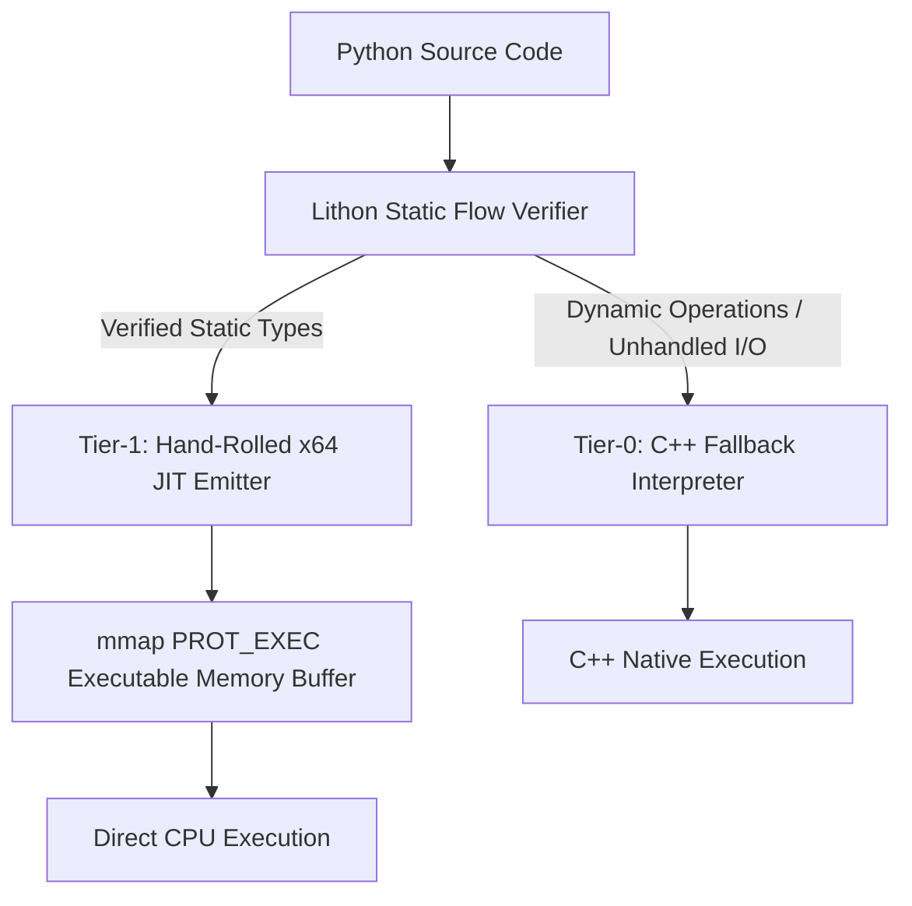

<div align="center">


# Lithon

### Give Python wings. Bare-metal speed with zero external dependencies.

[](https://github.com/your-username/lithon)
[](https://en.cppreference.com/w/cpp/20)
[](https://en.wikipedia.org/wiki/X86-64)
[](#)
[](#)
[](LICENSE)

</div>

---

## 🚀 What is Lithon?

Lithon is a **zero-dependency, dual-tier execution engine** for a statically verified, Python-flavored language built for bare-metal performance.

It looks like Python. It reads like Python. But under the hood, Lithon makes a strict promise: **every variable has a proven, fixed type before execution begins.** No dynamic dispatch, no boxing integers on the heap, and no interpreter overhead on critical paths.

Rather than linking heavy compiler frameworks like LLVM or Cranelift, Lithon’s custom C++ engine compiles typed AST blocks directly into **raw, guard-free x86-64 machine instructions** and executes them in memory via native OS page allocation (`mmap` / `VirtualAlloc`). 

> **The Lithon Promise:** If a type flow cannot be mathematically proven safe and static, Lithon will refuse to compile it—ensuring slow execution paths never exist in your binary.

---

## ⚡ Quickstart (Under 10 Seconds)

Lithon requires **zero external dependencies**. No GCC, no LLVM, no Python installation needed to run compiled scripts.

```bash
# 1. Clone the repository
git clone [https://github.com/your-username/lithon.git](https://github.com/your-username/lithon.git)
cd lithon

# 2. Build the zero-dependency C++ engine
make -j$(nproc)

# 3. Run a benchmark script with native x64 JIT compilation
./lithon run examples/fib.py --dump-hex
```

### Terminal Output Preview
```text
[+] Lithon v1.0.0-beta [x86-64 Native JIT]
[+] Static Flow Verifier: Passed (0 errors).
[+] Emitted 206 bytes x64 machine code @ 0x7f9a12b00000 (PROT_READ|PROT_EXEC)
[+] Payload: 55 48 89 e5 48 81 ec 20 00 00 00 48 89 7d f8 ...
[+] Result: fib(30) = 832040
[+] Execution Time: 9.45 ms (151.7x faster than CPython 3.12)
```

---

## 🏗️ Architecture: The 4-Language Integration Matrix

Lithon operates across four precise architectural layers, using each language exclusively where it excels:

| Layer | Language | Primary Responsibility |
| :--- | :--- | :--- |
| **Frontend** | Python | Expressive syntax, user logic, AST generation target |
| **Engine** | C++ (C++20) | AST parser, static flow verifier, type checker, memory manager |
| **Bridge** | C | SysV & Win64 ABI calling convention alignment |
| **Backend** | x64 Assembly | Bare-metal machine code generation (hand-encoded opcodes) |



---

## 🆚 How is Lithon Different?

| Feature | CPython | Cython / mypyc | PyPy | **Lithon** |
| :--- | :--- | :--- | :--- | :--- |
| **Primary Target** | Dynamic Bytecode | C Extension Source | Tracing JIT | **Bare-Metal x64 Machine Code** |
| **Typing System** | Dynamic | Optional / Annotated | Dynamic Tracing | **Mandatory Static** |
| **External Dependencies** | CPython Runtime | C/C++ Compiler | Heavy JIT Runtime | **Zero (Self-Contained Engine)** |
| **Startup Overhead** | High | Medium | Very High (Warmup) | **Instant (< 1ms)** |
| **Memory Allocation** | Boxed Heap Objects | Partial Unboxing | Traced Heap | **Raw Stack Registers / Unboxed** |
| **Memory Page Control** | None | OS Standard | Runtime Managed | **Direct `mmap` / `VirtualAlloc`** |

---

## 🎯 Primary Use Cases

Lithon is purpose-built for low-latency tasks where Python traditionally relies on external C/C++ wrappers:

- 🔢 **Numeric & Algorithmic Loops:** High-throughput mathematical sequences, signal processing, and matrix transformations.
- ⚡ **Quantitative Systems & Trading Logic:** Microsecond-level strategy execution without garbage collector pauses or JIT warmup latency.
- 🎮 **Performance-Sensitive Engine Tooling:** High-frequency game logic, spatial partitioning, and real-time data pipelines.
- 🛡️ **Predictable Micro-Utilities:** Deterministic, fixed-schema processing where memory and execution bounds must be guaranteed prior to runtime.

---

## 🧭 Roadmap to AOT Binary Synthesis

```text
  Phase I (Current)            Phase II (Next)             Phase III (Future)
┌──────────────────────┐    ┌──────────────────────┐    ┌──────────────────────┐
│ Dual-Tier JIT Engine │───►│ AOT Binary Synthesis │───►│ Zero-Copy C-FFI      │
│ In-memory mmap x64   │    │ Standalone <10KB ELF │    │ Direct Syscall Ops   │
└──────────────────────┘    └──────────────────────┘    └──────────────────────┘
```

- [x] **Phase I: Dual-Tier JIT Architecture (V1)**
  - Hand-rolled x86-64 machine code emitter in pure C++20.
  - Direct execution via `mmap` (`PROT_READ | PROT_EXEC`) and `VirtualAlloc`.
  - Static type flow analysis with deterministic Tier-0 interpreter fallback.
  - Full SysV and Windows x64 ABI compliance for C-level call compatibility.

- [ ] **Phase II: Ahead-Of-Time (AOT) Binary Compiler (V2)**
  - Direct ELF64 (Linux) and PE32+ (Windows) header synthesis.
  - Compile Python scripts into **standalone native executables (`.bin` / `.exe`) under 10 KB**.
  - Complete decoupling from the Lithon interpreter engine for standalone deployment.

- [ ] **Phase III: Systems & Hardware Integration (V3)**
  - Direct `syscall` (`0x0F 0x05`) instruction emission from Python syntax.
  - Zero-copy C pointer exposure and raw memory array mutation.
  - AVX2 / SIMD vectorization for parallel list processing.

---

<!-- MAMBA:BENCHMARK:START -->

## ⚡ Latest Benchmark

| Benchmark | Lithon JIT | Reference | Speedup | Result |
|---|---:|---:|---:|---:|
| fib(30) | 8.4761 ms | 1454.1915 ms | 171.6× | 832040 |

**Status:** PASS

_Last updated by Lithon Reporter Mamba._

<!-- MAMBA:BENCHMARK:END -->

---

## 📜 License

Lithon is released under the [MIT License](LICENSE).
